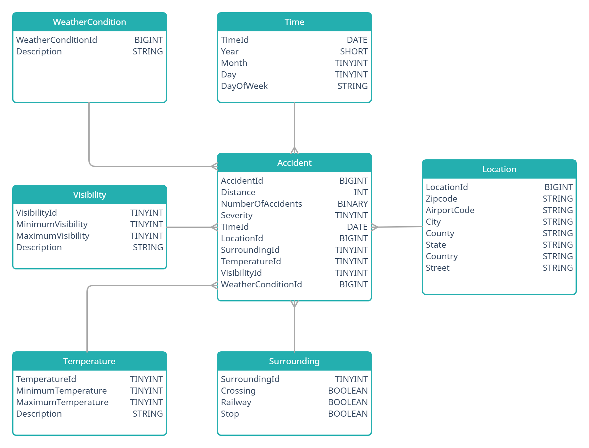

# US Accidents Data Warehouse
A project uses Spark and Scala to transform data available in CSV files and text file into a data warehouse.
The data warehouse uses also Airflow (Composer)  to orchestration and Big Query to store data about accidents in tables.

## Data
The source of the data is `https://www.kaggle.com/sobhanmoosavi/us-accidents`.

The data are available in `us-accidents.zip`.
The archive contains nine files:
1. `mainDataCentral.csv`, `mainDataEastern.csv`, `mainDataMountain.csv`, `mainDataPacific.csv` – data about accidents in US
2. `geoDataCentral.csv`, `geoDataEastern.csv`, `geoDataMountain.csv`, `geoDataPacific.csv` – data about accidents' localization
3. `weather.txt` - data about weather from different airports

## Warehouse schema

### Facts
The data stored in the warehouse are described by 2 facts:
- Number of Accidents - stored as HLL (HyperLogLog)
- Distance - sum of the length of the road extent affected by the accident

Thanks to using HLL even if one accident blocked a road for a few days, it is counted as one.

### Dimensions
The data stored in the warehouse are described by 7 dimensions:
- Time
- Location
- Surrounding
- Temperature
- Visibility
- Weather Condition
- Severity (degenerated dimension)

## Processing
### Technologies
The following technologies and libraries are used by the project:
- Scala 2.12
- Spark Core 3.1.2 - the main Spark library
- Spark SQL 3.1.2 - the Spark library enabling using DataFrames and DataSets
- Spark Alchemy 1.1.0 - library enabling using HLL
- Airflow - orchestration of the creating tables in Big Query and running Spark jobs

### Running
Each class in main catalog is independent program with its `main` method.
- TimeLoader - fill the Time table with data
- LocationLoader - fill the Location table with data
- SurroundingLoader - fill the Surrounding table with data
- TemperatureLoader - fill the Temperature  table with data
- VisibilityLoader - fill the Visibility table with data
- WeatherConditionLoader - fill the WeatherCondition table with data
- AccidentLoader - fill the Accident table with data

## Airflow (Composer)
To run Airflow DAG for this project, you have to do the following steps:
1. Create bucket for storing temporary file by Spark during working with Big Query
2. Create bucket for storing required files:
    - `spark-alchemy-assembly-1.1.0.jar` - JAR with Spark Alchemy Assembly,
    - `us-accidents-warehouse_2.12-1.0.0.jar` - JAR with compiled project,
    - unzipped CSV files
3. Fill `variables.json` with proper values and load them to Airflow
4. Upload `composer-workflow.py` to the bucket with DAGs

`composer-workflow.py` contains all steps required to run processing:
1. Create Dataproc cluster
2. Delete old Big Query dataset (if exists)
3. Create new Big Query dataset
4. Create all required tables in Big Query
5. Run Spark jobs loading data to the dimensions tables
6. Run Spark job loading data to the fact table
7. Delete Dataproc cluster
